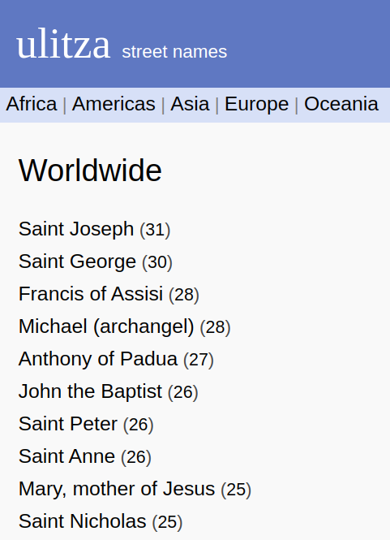
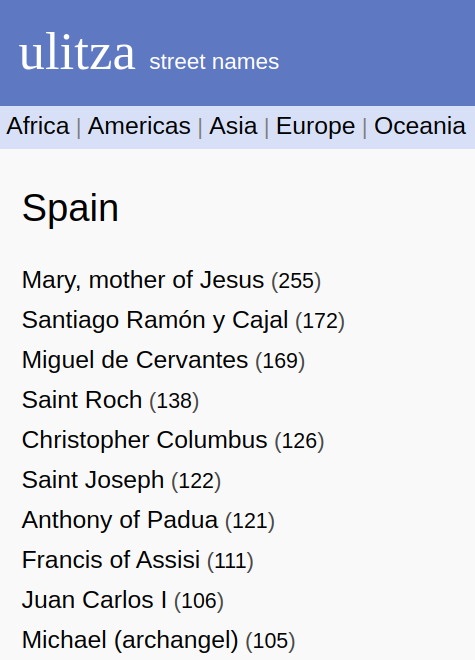

# What

Lists of streets and landmarks named after a person (eponyms) for all countries
worldwide.

<p float="left">
  
  
</p>

(screenshots from [ulitza.net](https://ulitza.net))

Each list is sorted by the number of cities that have streets or landmarks named
after that person, or by the number of countries in the case of the "worldwide"
view.

All person names are wikipedia links. The count also reveals the countries where
that person appears in, and the country name links to the raw street names, on
github, where one can edit the eponyms file and also see the non-eponymous
street names as well.

# Purpose

Explore each country's unique history, cultural influences and it's best known
heroes, revolutionaries, leaders, scientists or artists of the past. All this
through the way in which each country has decided to name its streets and
landmarks.

# How

All data is taken from
[openstreetmap](http://download.geofabrik.de/index.html). Affixes like "street",
"boulevard", "square", etc are ignored (see [affixes.js](affixes.js))
and all names referring to a single person, although spelled differently, are
considered as one person (see [equivalents.js](equivalents.js)).

Only one occurence is allowed per city. This makes the data a bit unrealistic,
since big cities usually have schools, monuments, squares and streets all named
after that same person. But it's also a way to defend against duplicate entries
in the osm file, where a single street is sometimes tagged dozens of times.

I've only considered eponym frequencies greater than one. This defends primarly
against garbage data and also against large output files.

All wikipedia links have been added manually.

# Contribute

## Eponyms
In the [eponyms/](eponyms/) folder there is a list of all the available
countries. Each [country].json file contains the complete list of street names
for that [country]. Some entries have wikipedia links associated with them,
which means they are eponyms and some other are just street names like "main",
"school", which are actually ignored.

Some persons might have the wrong wikipedia link assigned to them or some
persons might not have any link assigned to them. Edit the country file directly
and make a PR with the description of your changes. The project is afterwards
updated automatically, so you don't need to clone it nor do anything else to see
your updates.

## Equivalents
The [equivalents.js](equivalents.js) file contains, for each [country], a list
of equivalent entries all referring back to the same person. That is, you will
see this,

```
["Bombardier",  "J.-A.-Bombardier",
                "Armand-Bombardier"]
```

which means that these all appear as street names, but they all actually refer
to the same person. The first name in this list, Bombardier, will have the
wikipedia link associated with it in the [eponyms/canada.json] file. The others
are just "merged", so to speak, into this one. 

If you spot a new equivalent, or a wrong one, modify the file and then call

```
node ./ulitza.js update canada
```

or for the country for which you've made the change. You will need to clone
the project for this kind of contribution.

## Affixes
The [affixes.js](affixes.js) file contains regexes for each country. 


# Example

In case you want to modify your favorite country, let's say Spain, either to
edit an eponym, add a new one, modify the equivalents or affixes, or just play
around, here are all the steps.

## Download

Download the spain-latest.osm.pbf file from
[openstreetmap](http://download.geofabrik.de/index.html) into the "osm_data" folder,
```
node ./ulitza.js download spain
```

## Extract

Extract the street names into the "raw" folder; this is the raw format, without
affixes removed, without applying any equivalents and without removing duplicate
entries. This is the perfect place to explore adding new affixes and equivalents,
```
node ./ulitza.js extract spain
```

## Check / verify

Check if there are duplicate wikipedia links in the
[eponyms/spain.json](eponyms/spain.json) and also duplicate equivalents,

```
node ./ulitza.js check spain
```

In case of duplicate links, you need to add an equivalent. In case of duplicate
equivalents, you need to remove one (but not the one containing the wikipedia
link)

## Update

Update the [eponyms/spain.json](eponyms/spain.json) file with the latest data,
```
node ./ulitza.js update spain
```

Commit the output file.

# List of commands

```
Usage: node ./ulitza.js [command]

Commands:
  download <country>         Download the latest osm data for the given
                             <country>.
  extract <country>          Extract a first, raw, version of all the street
                             names for the given <country>.
  update [country]           Generate the eponym file for the given [country].
                             If [country] is not specified, generate the eponym
                             file containing the data for all countries.
  check [country]            Verify if [country] has duplicate equivalent
                             entries, duplicate urls or consistent urls. If the
                             [country] is not specified, return a list of all
                             the countries where such checks fail.
  inspect <country> <regex>  Inspect the <country> raw osm data. Useful in
                             finding new osm tags containing possible eponyms.
                             Only needed if we're going to modify the
                             generator.
  help [command]             display help for command
```
